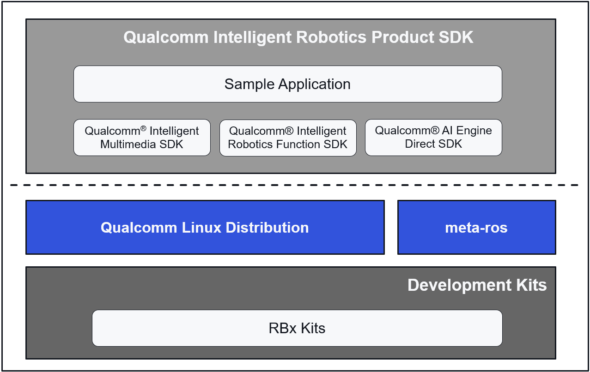

Environment setup
#################

This information provides instructions on how to download and use the robotics prebuilt package, allowing you to quickly set up the software and hardware environment to get an out-of-the-box experience. The prebuilt package includes:

- Robotics image: An image based on the Qualcomm Linux release with the ROS core packages added and the QIRP SDK included by default. You can directly use the robotics image to get an out-of-the-box experience.
- QIRP SDK: Provides not only a runtime installation package with the out-of-the-box experience, but also a cross-compilation toolchain. Using that toolchain, you can quickly develop an application based on the sample code.

The figure shows the overall software architecture of the QIRP SDK:

Prerequisites
-------------

   - QIRP SDK supports RB3 Gen2 Development Kit. Please set up your hardware with `Qualcomm® RB3 Gen2 Development Kit Quick Start Guide <https://docs.qualcomm.com/bundle/publicresource/topics/80-70014-253>`_.
   - To access the document, please complete the registration of Qualcomm account on `Qualcomm® website <https://www.qualcomm.com/>`_.

.. _env-setup:

Steps
-------------

1. Download the prebuilt package.

   .. code-block:: bash

      wget https://artifacts.codelinaro.org/artifactory/qli-ci/flashable-binaries/qirpsdk/qcm6490/x86/<robotics-product-sdk>

   .. note:: 

       ``<robotics-product-sdk>`` indicates the version of the zip file, such as ``qcom-6.6.28-QLI.1.1-Ver.1.1_robotics-product-sdk-1.1.zip``.

2. Extract the package with the following command:

   .. code-block:: bash

      unzip qcom-6.6.28-QLI.1.1-Ver.1.1_robotics-product-sdk-1.1.zip

   The contents and their respective locations are listed in this table:

   +----------------+----------------------------+------------------------------------------------------------+ 
   |  Content type  |   File or directory name   |                        location                            | 
   +================+============================+============================================================+ 
   | Robotics image |  qcom-robotics-full-image  |         <decompressed_workspace >/target/qcm6490           | 
   +----------------+----------------------------+------------------------------------------------------------+ 
   |    QIRP SDK    |  qirp-sdk_<version>.tar.gz | <decompressed_workspace >/target/qcm6490/qirpsdk_artifacts | 
   +----------------+----------------------------+------------------------------------------------------------+ 

3. Build a standalone QDL by completing the following steps, which are described in `How to build a standalone QDL <https://docs.qualcomm.com/bundle/publicresource/topics/80-70014-254/how_to.html#how-to-build-a-standalone-qdl->`_.

   - Install dependent packages.
   - Download and compile the Linux flashing tool (QDL).

4. Force the device to enter EDL mode to enable software flashing with the steps described in `Emergency download (EDL) mode <https://docs.qualcomm.com/bundle/publicresource/topics/80-70014-254/flash_images_unregistered.html#flash_images_unregistered__section_vgg_mly_v1c>`_. 

5. Flash the robotics image to the device using the generated QDL.

   .. note:: 

      The QDL for robotics SDK is generated in a different path. 
      Ensure to use the following commands to flash QDL to the device, where ``<prebuilt_package_extracted_path>`` indicates the root path of the extracted prebuilt package.

   .. code-block:: bash

      ./qdl --storage ufs --include <prebuilt_package_extracted_path>/target/qcm6490/qcom-robotics-full-image \
      <prebuilt_package_extracted_path>/target/qcm6490/qcom-robotics-full-image/prog_firehose_ddr.elf \
      <prebuilt_package_extracted_path>/target/qcm6490/qcom-robotics-full-image/rawprogram*.xml \
      <prebuilt_package_extracted_path>/target/qcm6490/qcom-robotics-full-image/patch*.xml

6. Set up the cross-compile environment in QIRP SDK using the following command.

   .. note::
      QIRP SDK integrates the cross-compile toolchain, which includes common build tools, such as aarch64-oe-linux-gcc, make, cmake, and ROS core.

   
   .. code-block:: bash

      cd <qirp_decompressed_workspace>/qirp-sdk
      source setup.sh
