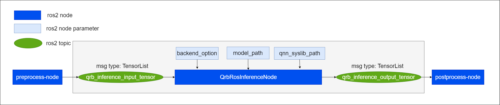

====================
QRB ROS NN Inference
====================

Overview
--------

qrb_ros_nn_inference is a ros2 package for performing neural network model, providing AI-based perception for robotics applications.
qrb_ros_nn_inference offers hardware acceleration based on Qualcomm platforms, utilizing pre-trained models from the Qualcomm AI Hub to receive input tensor and output the prediction to output tensor.

here comes the usage scenario of qrb_ros_nn_inference:

.. note:: TensorList is a custom ROS2 message type, more detail in `qrb_ros_tensor_list_msgs <https://github.com/quic-qrb-ros/qrb_ros_tensor_list_msgs>`__.

qrb_ros_nn_inference is only for executing AI model inference, user should prepare a pre-process node and post-process node.
pre-process node is for publishing the input data for model inference.
post-process node is for analysis the raw output data after model inference.

.. note:: qrb_ros_nn_inference can be called in parallel.

Quickstart
----------

Set up
~~~~~~

Currently, we only support build with QCLINUX SDK.

1. Setup QCLINUX SDK environments follow this document: `Set up the
   cross-compile
   environment <https://docs.qualcomm.com/bundle/publicresource/topics/80-65220-2/develop-your-first-application_6.html?product=1601111740013072&facet=Qualcomm%20Intelligent%20Robotics%20(QIRP)%20Product%20SDK&state=releasecandidate>`__

2. Create your ``ros_ws`` directory in
   ``<qirp_decompressed_workspace>/qirp-sdk/``

  .. code:: bash

      mkdir -p <qirp_decompressed_workspace>/qirp-sdk/ros_ws

Construct ROS pipeline
~~~~~~~~~~~~~~~~~~~~~~

1. Clone your pre-process node and post-process node under
   ``<qirp_decompressed_workspace>/qirp-sdk/ros_ws``

  .. code:: bash

      cd <qirp_decompressed_workspace>/qirp-sdk/ros_ws && \
      git clone https://github.com/my_github/pre-process_node.git && \
      git clone https://github.com/my_github/post-process_node.git

2. Clone this repository and dependencies under
   ``<qirp_decompressed_workspace>/qirp-sdk/ros_ws``

  .. code:: bash

      cd <qirp_decompressed_workspace>/qirp-sdk/ros_ws && \
      git clone https://github.com/quic-qrb-ros/qrb_ros_tensor_list_msgs.git && \
      git clone https://github.com/quic-qrb-ros/qrb_ros_nn_inference.git

3. Dynamically add inference node into the ros2 component container in your launch file

  .. code:: python

    ComposableNode(
      package = "qrb_ros_nn_inference",
      plugin = "qrb::ros::QrbRosInferenceNode",
      name='qrb_ros_nn_inference_node'
    )

Build your ROS pipeline
~~~~~~~~~~~~~~~~~~~~~~~

1. Colcon build your pipeline:

  .. code:: bash

    cd <qirp_decompressed_workspace>/qirp-sdk/ros_ws && \
    export AMENT_PREFIX_PATH="${OECORE_TARGET_SYSROOT}/usr;${OECORE_NATIVE_SYSROOT}/usr" && \
    export PYTHONPATH=${PYTHONPATH}:${OECORE_TARGET_SYSROOT}/usr/lib/python3.10/site-packages && \
    colcon build --merge-install --cmake-args \
      -DPython3_ROOT_DIR=${OECORE_TARGET_SYSROOT}/usr \
      -DPython3_NumPy_INCLUDE_DIR=${OECORE_TARGET_SYSROOT}/usr/lib/python3.10/site-packages/numpy/core/include \
      -DPYTHON_SOABI=cpython-310-aarch64-linux-gnu -DCMAKE_STAGING_PREFIX=$(pwd)/install \
      -DCMAKE_PREFIX_PATH=$(pwd)/install/share \
      -DBUILD_TESTING=OFF

Run
~~~

1. Source this file to set up the environment on your device:

  .. code:: bash

      ssh root@[ip-addr]
      (ssh) export HOME=/opt
      (ssh) source /opt/qcom/qirp-sdk/qirp-setup.sh
      (ssh) export ROS_DOMAIN_ID=xx
      (ssh) source /usr/bin/ros_setup.bash

2. Launch your inference pipeline

  .. code:: bash

      (ssh) ros2 launch ${package_name} ${launch-file}

Supported Platforms
-------------------

.. include:: ../common/supported_platforms.rst

Resources
---------

-  `Qualcomm AI Hub <https://aihub.qualcomm.com>`__: AI models optimized and validated by Qualcomm Technologies.

Updates
-------

.. list-table::
    :header-rows: 1

    * - Date
      - Changes

    * - 2024/07/17
      - Initial release
